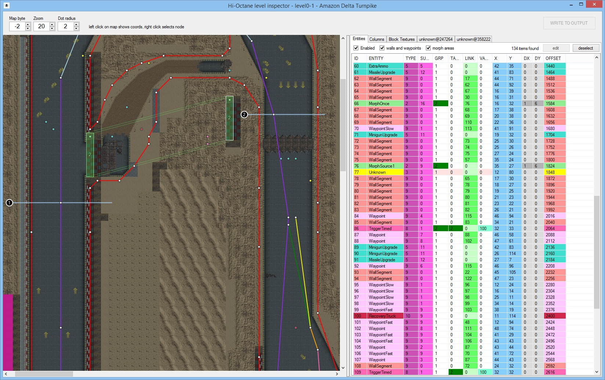
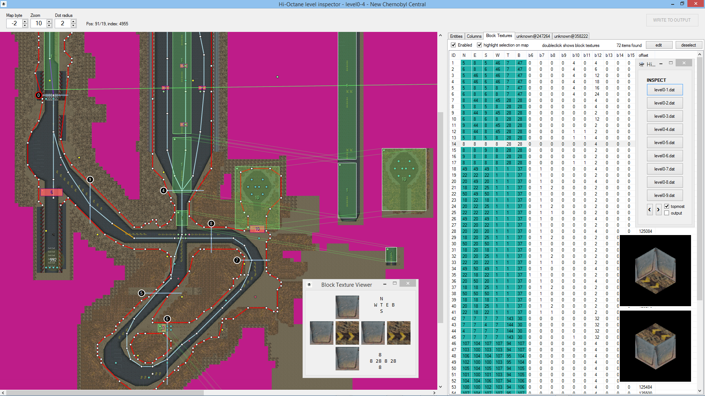
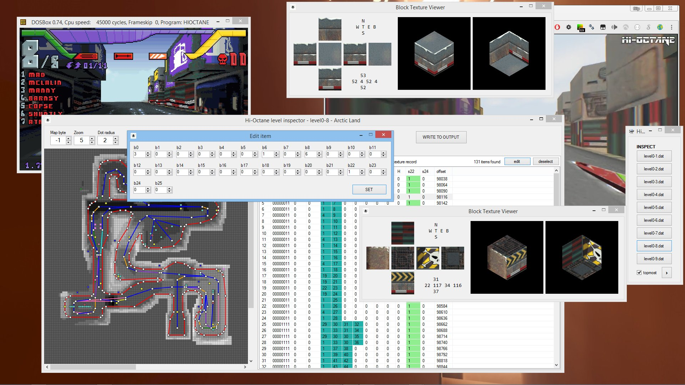
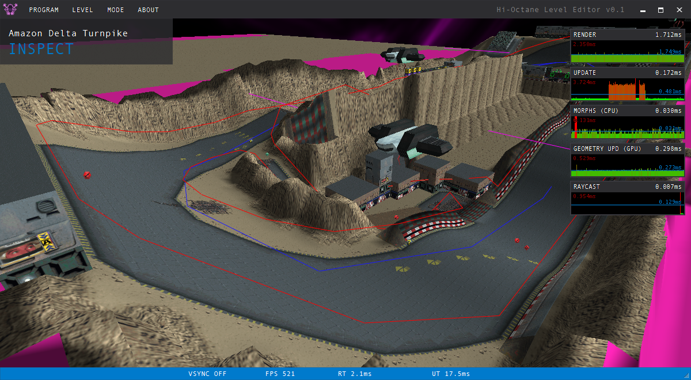
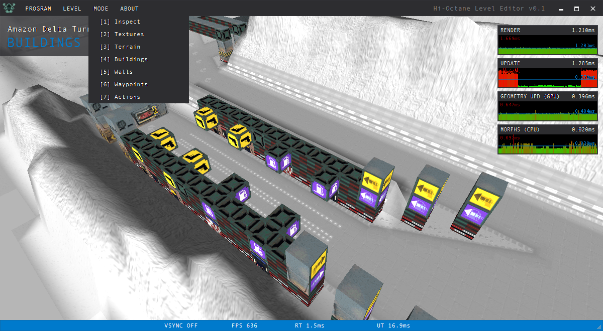
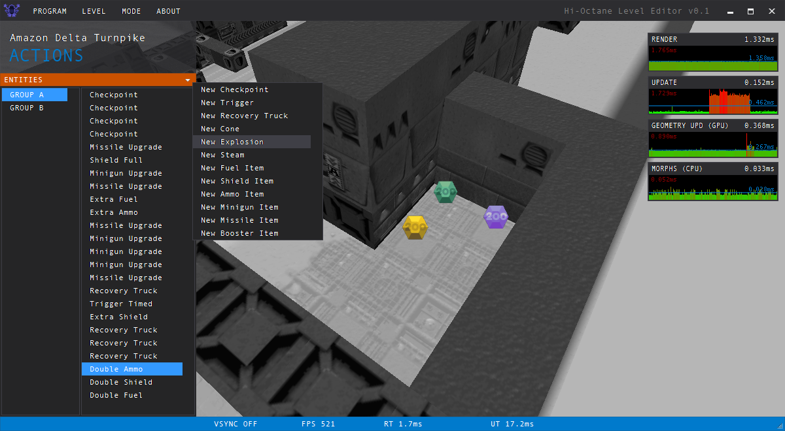
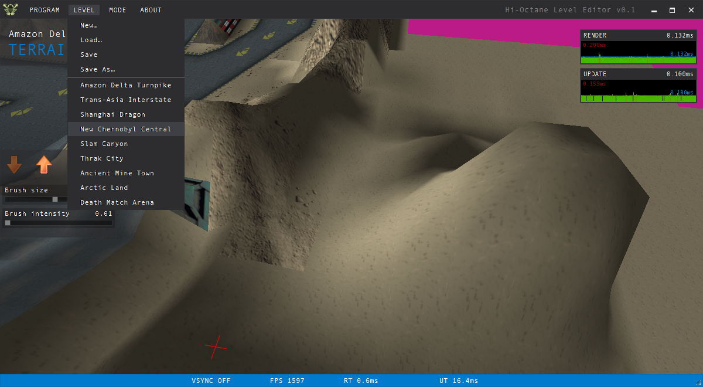

# Hi-Octane Tools
Tools to inspect and modify levels of the game Hi-Octane by Bullfrog (1995).
The reverse-engineering work on all files of the game was done by srtuss (most of it) and movAX13h in winter 2016.

---

### Inspector
Loads and displays all entities of a level file and related assets.

---

### Editor (unfinished)
The editor can be used to modify existing levels and, when it's finished, to create new ones from scratch. Some modes are not implemented yet. If you have time, please help!

### Source code
C#/.NET VisualStudio 2013 Solution - The inspector uses Windows forms and the editor is made in a custom engine using OpenTK.

---

### Download
- Level Inspector binary from author server: http://thrill-project.com/archiv/coding/Hi-OctaneLevelInspector.zip (2.7MB)
- Level Editor binary from author server: http://thrill-project.com/archiv/coding/Hi-OctaneLevelEditor.zip (5.2MB)

---

## Structures and Concepts

### Columns & Blocks ###

Columns sit on map cells with negative floor texture ID. The negative ID is the column ID. Each column has 8 slots for blocks. Whether a slot contains a block or not is defined by the respective bit of the shape byte. The ID of the block (type or BlockDefinition as I called it in code) of the particular block is in A to H. 

Blocks are described in the other table. Only the texture IDs for all 6 sides (North, East, South, West, Top, Bottom) and their rotation (b6 to b11) is stored (that's why the table is called "Block Textures" in the level inspector):

The height of a block is 1 unit but the whole column (all blocks in it) is transformed based on the cell it is standing on:

If a column is standing on a cell that is affected by a morph (height change), it adapts to the new height. In some cases there are columns in the source area - these are used to mirror-morph then. In my editor, I'm creating dummy columns at source positions if there are none to always have source and target values. In this video, on the right side you can see the columns change with the terrain morph: https://www.youtube.com/watch?v=lMp3-hK7Jms There are cases where the target columns get removed (after a morph triggered by a rocket in level 3 for example) but I will write about this in a separate section on morphs.

---

### Entities ###

... are objects/triggers/nodes/morphs in the world. I called all of these 'entities'. Entity positions are unique (a map cell can have only 1 entity - this seems to be a restriction in the original level editor). There are many different types of entities. Some are self explanatory and all of them can be seen in the inspector with additional helper lines to visualize connections between entities. 

Hint: The tables in the level inspector can be sorted by clicking the column header. This helps a lot when trying to understand how things are connected.

All entities have a type, a subtype and a group (GRP). Most entities are in group 1 and those are visible/activated at level start. All other groups are activated by triggers.

The following list contains all entities used by the Hi-Octane level files (ordered by type and subtype):
See [createEntity(EntityItem entity) in Level.cs](https://github.com/movAX13h/HiOctaneTools/blob/480d902d726baef09b1e62f4e3d76851955afa40/Editor/Games/HiOctane/Level.cs#L256)

| Type | Sub type | Name               | Description |
|:----:|:--------:| ------------------ | ----------- |
|1     |5         |Checkpoint          | Actually a line, not a point. Used to determine race progress. The entries are numbered (VALUE column). DX and DY are used to describe the line  |
|      |          |||
|2     |1         |Explosion Particles | Sprite animation particles; triggered; Example: Level 3, when the wall explodes (not the particles from the rocket) https://www.youtube.com/watch?v=C6Uoj8dgWy0 |
|2     |2         |Damage Craft        | A single spot that deals damage to a craft permanently; Example: Level 5 |
|2     |3         |Explosion           | Sprite animation; triggered; stays at position |
|2     |5         |Steam Strong        | Sprite animation; triggered by timers in most cases; Example: Level 5; here in the middle:  |
|2     |7         |Morph Source 2      | Describes the source rectangle for a morph (DX, DY); it is unknown how it is different from 'Morph Source 1'; occurs only in level 9, outside of the race track |
|2     |8         |Steam Light         | Sprite animation; triggered by timers in most cases; Example: Level 5; here on the sides:  |
|2     |9         |Morph Source 1      | Describes the source rectangle for a morph (DX, DY; outside of the race track in many cases) |
|2     |16        |Morph Once          | Describes the target rectangle for a morph (DX, DY); Linked to a morph source entity; when activated, it mirror-morphs and stopps |
|2     |23        |Morph Permanent     | Describes the target rectangle for a morph (DX, DY); Linked to a morph source entity; when activated, it mirror-morphs non-stop without delay between transitions |
|      |          |||
|3     |6         |Cone                | A cone 3D model |
|      |          |||
|5     |0         |Unknown Shield Item | See below. I don't know what it does. |
|5     |1         |Unknown Item        | It is invisible but used in the level files; maybe enabled in a mode I have not played; Example: Level 2 |
|      |          |||
|5     |2         |Extra Shield        | See below |
|5     |3         |Shield Full         | See below |
|5     |4         |Double Shield       | See below |
|5     |5         |Extra Ammo          | See below |
|5     |6         |Ammo Full           | See below |
|5     |7         |Double Ammo         | See below |
|5     |8         |Extra Fuel          | See below |
|5     |9         |Fuel Full           | See below |
|5     |10        |Double Fuel         | See below |
|5     |11        |Minigun Upgrade     | See below |
|5     |12        |Missile Upgrade     | See below |
|5     |13        |Booster Upgrade     | See below |
|      |          |||
|8     |0         |Trigger Craft       | Activates a group if a craft enters its hitbox; rectangle described by DX and DY |
|8     |1         |Trigger Timed       | Activates a group after a period of time described by VALUE (100 is aprox. 4s in my tests) |
|8     |3         |Trigger Rocket      | Activates a group if a rocket hits the cell (the full bounding box of the geometry at cell position); Example: Level 3, https://www.youtube.com/watch?v=C6Uoj8dgWy0 |
|      |          |||
|9     |0         |Wall Segment        | Collision walls; each wall is linked to ('draws a line to') the next wall except LINK is 0; image shows walls and waypoints: |
|9     |1         |Waypoint Slow       | A waypoint for non-player crafts to decelerate. |
|9     |2         |Waypoint Fuel       | A waypoint for non-player crafts that leads to a fuel station. |
|9     |3         |Waypoint Ammo       | A waypoint for non-player crafts that leads to an ammo station. |
|9     |4         |Waypoint Shield     | A waypoint for non-player crafts that leads to a shield station. |
|9     |6         |Waypoint Shortcut   | A waypoint for non-player crafts; a shortcut I think |
|9     |7         |Waypoint Special1   | A waypoint for non-player crafts; connecting different parts |
|9     |8         |Waypoint Special2   | A waypoint for non-player crafts; connecting different parts  |
|9     |9         |Waypoint Fast       | A waypoint for non-player crafts to accelerate. |
|9     |10        |Waypoint Special3   | A waypoint for non-player crafts; connecting different parts  |
|      |          |||
|10    |9         |Recovery Truck      | Spawn position for a recovery truck (3D model) |

### Morphs & Triggers ###

All morphs are bidirectional. This means that the heights of the source area cells transition to the heights of the target area cells and the target area transitions to the height of the source area.
https://youtu.be/WJniHteG6G0

However, only target morph entities (MorphOnce and MorphPermanent) are linked to their sources using LINK (always references other entries in the entities table by ID). Columns on top of morphing cells adapt to the new height by default as if the whole world was made of one mesh but there are different constellations aswell.

The following illustrates how the morphing wall in level 1 is set up:

https://youtu.be/CHFXNau8b4U

1. Trigger 109 is run on game start since it is in group 1
2. It is a timer trigger so it has the delay time in the VALUE column (100 in this case; that's about 4 seconds)
3. After the delay, the trigger enables all entities in group 2 because it has group 2 in the TARGET GRP column (red arrows)
4. Group 2 contains another trigger and a morph set consisting of a source and a target which is a MorphOnce in this case
5. The trigger in group 2 is identical to the one in group 1. This means that, when it triggers after the delay, it triggers the group itself is in so that it repeats forever. (green and yellow arrows)

A MorphPermanent has no delay between transitions and can be in group 1.
Morphs can be triggered by any other type of trigger too.

There is an inner logic with morphs and columns and how they are affected if source and target area differ. It is implemented in my level editor but please remind me to write that down if I forget :)

---

### Collectable Items ###

All collectable items (entities) have type 5. The blue number is the subtype:

These objects are billboard sprites by the way.

---

### Unknown ###

The only unknown entity is 3.3 (type 3, subtype 3) which is probably the barrel model that is never visible in the game and somehow disabled in game code or only visible in a mode that I've not played.

We have not found any hints about the spawn position of the player crafts in the level data file.

We also don't know exactly how the areas for the stations (fuel, ammo, shield) are defined. There are some very high numbers in map byte 6 exactly at the positions of the stations but the numbers do not match across levels.